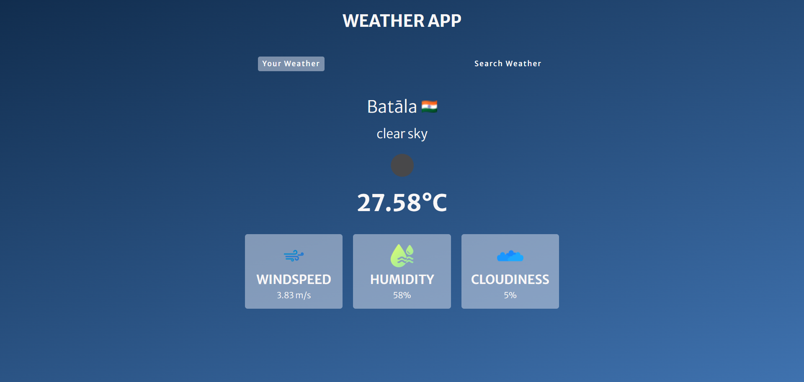
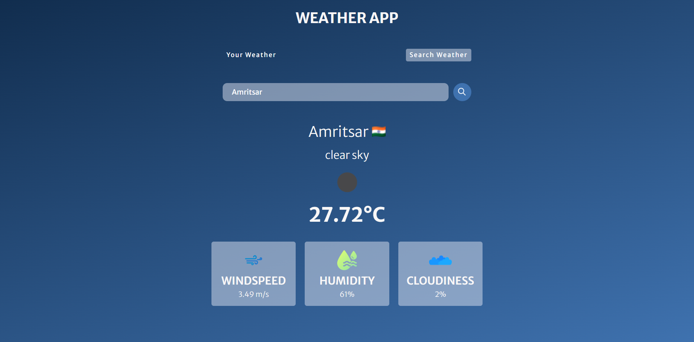

# 🌤️ Weather App

A clean, responsive weather application built with **vanilla JavaScript** that fetches real-time weather data from the OpenWeatherMap API. It supports both **location-based weather** and **city search**.



## 🚀 Live Demo

👉 👉 [View Live](https://shivanikumari5.github.io/weather-app/)

## ✨ Features

- 📍 **Your Weather** — Get weather for your current location (uses Geolocation API)
- 🔍 **Search Weather** — Search any city worldwide
- 🌡️ Shows temperature, weather description, wind speed, humidity, and cloudiness
- 🏳️ Displays the country flag of the searched/current city
- 💾 Remembers your location coordinates using `sessionStorage`
- 📱 Fully responsive — works on mobile, tablet, and desktop
- ❌ Error handling for invalid city names
- ⏳ Loading state while fetching data

## 🛠️ Tech Stack

- **HTML5** — Structure
- **CSS3** — Styling (Flexbox, CSS variables, media queries)
- **JavaScript (ES6+)** — Logic, `fetch` API, async/await, geolocation
- **OpenWeatherMap API** — Weather data
- **FlagCDN** — Country flags

## 📁 Project Structure

```
weather-app/
├── index.html
├── style.css
├── script.js
├── README.md
└── assets/
    ├── location.png
    ├── search.png
    ├── loading.gif
    ├── wind.png
    ├── humidity.png
    ├── cloud.png
    ├── not-found.png
    └── preview.png
```

## ⚙️ How to Run Locally

1. **Clone the repository**
   ```bash
   git clone https://github.com/ShivaniKumari5/weather-app.git
   cd weather-app
   ```

2. **Open `index.html` in your browser**

   That's it — no build step required. Or use VS Code's **Live Server** extension for auto-reload.

3. **Get an API key (if you don't have one)**

   - Sign up at [OpenWeatherMap](https://openweathermap.org/api)
   - Copy your API key
   - Open `script.js` and replace:
     ```js
     const API_key = "YOUR_API_KEY_HERE";
     ```

## 🔐 API Key Safety Note

This project uses the OpenWeatherMap API key on the client side. Since this is a public repo, the key is visible. To keep it safer:

- Restrict the key to your GitHub Pages domain in the OpenWeatherMap dashboard
- Or rotate the key periodically
- For production apps, use a backend proxy + environment variables

## 📸 Screenshots

| Your Weather | Search Weather |
|--------------|----------------|
|  |  |

## 🧠 What I Learned

- Working with `fetch`, `async/await`, and REST APIs
- Using `navigator.geolocation` for location access
- Managing UI states with CSS classes (`active`)
- `sessionStorage` for lightweight state persistence
- Building responsive layouts with Flexbox + media queries
- Handling errors gracefully (invalid city, no location permission)

## 🙌 Acknowledgements

- Weather data by [OpenWeatherMap](https://openweathermap.org/)
- Flags by [FlagCDN](https://flagcdn.com/)
- Fonts from [Google Fonts](https://fonts.googleapis.com/)
- Icons from [Flaticon](https://www.flaticon.com/)

## 📄 License

This project is open source and available under the [MIT License](LICENSE).